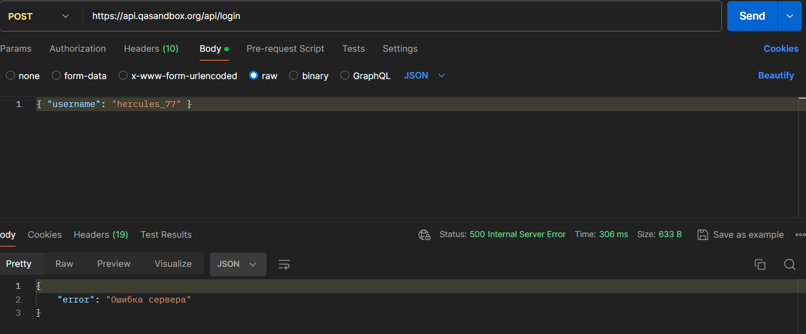

# Баг-репорт
## BUG-API-001: POST /api/login возвращает 500 вместо 400

**Severity:** Major
**Priority:** Medium
**Environment:** Postman
**Endpoint:** POST /api/login

**Предусловие:**
1. Настроен Environment с base_url 
2. Коллекция Swagger API Testing создана

**Шаги воспроизведения:**
1. Создать POST-запрос на https://api.qasandbox.org/api/login
2. Ввести body только со значнием username, без password 
{ "username": "hercules_77" }
3. Нажать Send

**Ожидаемый результат:**
Код 400 с сообщением "error": "Missing password".

**Фактический результат:**
Код 500 с сообщением "error": "Ошибка сервера"

**Вложения:**

**Ссылка на тест-кейс:** TC-API-002