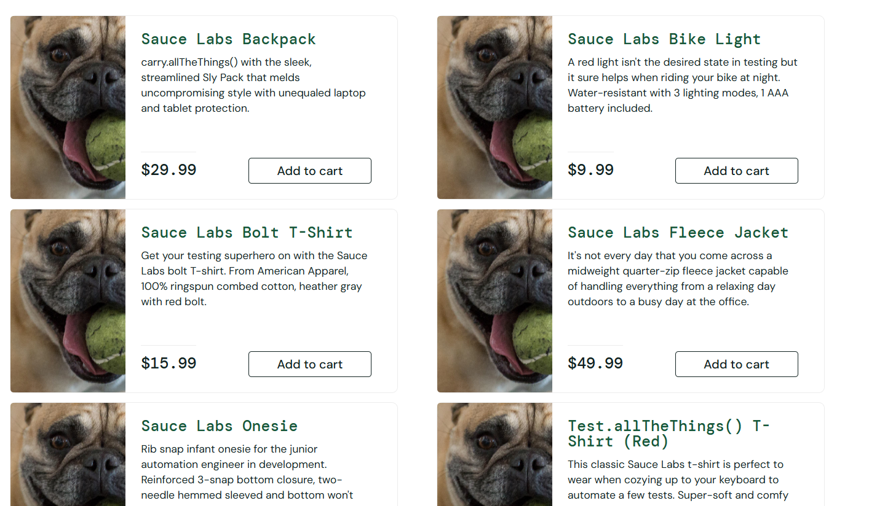
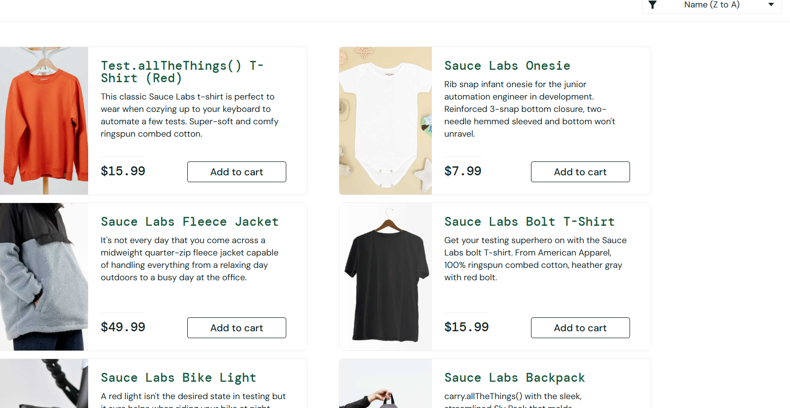
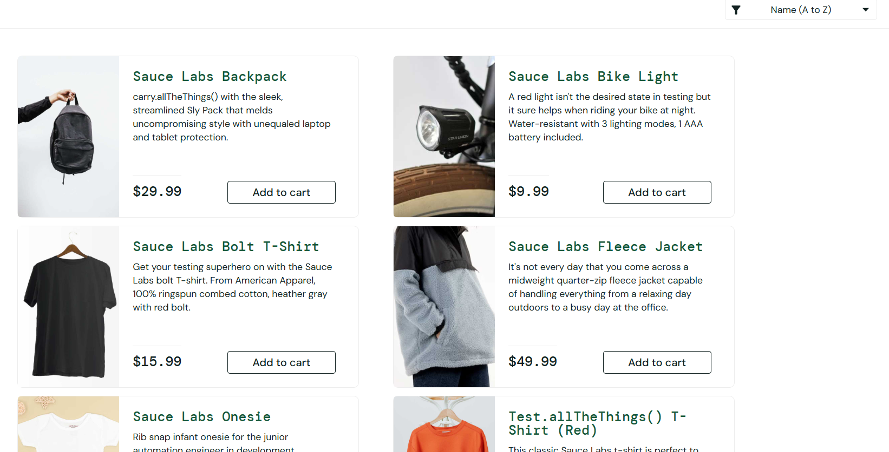
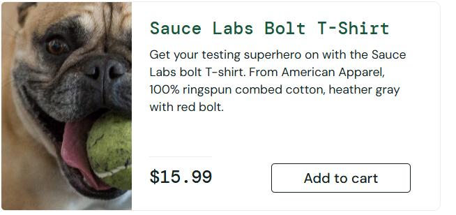
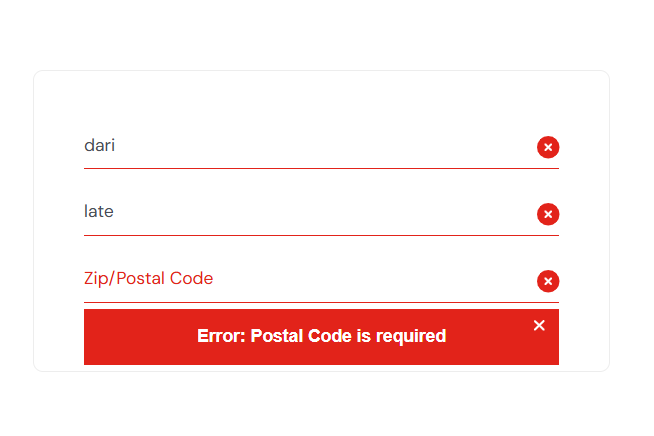
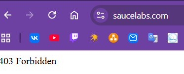

# Баг-репорт

**BUG-001:** Изображения всех товаров одинаковые и не соответствуют названиям
**Severity:** Major
**Priority:** High
**Environment:** Windows 11, Chrome 120, problem_user
**URL:** https://www.saucedemo.com/inventory.html

**Предусловие:**
1. Открыт saucedemo.com
2. Выполнен вход как problem_user

**Шаги воспроизведения:**
1. Перейти на страницу каталога товаров
2. Посмотреть на изображение первого товара
3. Сравнить изображение с названием товара
4. Повторить для всех 6 товаров

**Ожидаемый результат:**
Изображение каждого товара соответствует его названию и описанию. Все 6 изображений разные.

**Фактический результат:**
Все товары имеют одинаковое изображение (собака).
Изображения не соответствуют названиям.

**Вложения:**

**Ссылка на тест-кейс:** TC-009

---

**BUG-002:** При выборе сортировки "Name (Z to A)", при выходе из корзины данная сортировка слетает
**Severity:** Major
**Priority:** High
**Environment:** Windows 11, Chrome 120, пользователь standard_user
**URL:** https://www.saucedemo.com/inventory.html

**Предусловие:**

1.Выполнен вход как standard_user

**Шаги воспроизведения:**

1. Перейти на страницу каталога
2. В выпадающем списке сортировки выбрать "Name (Z to A)"
3. Зайти в корзину
4. Вернуться к покупкам нажав на "Continue shopping"
5. Посмотреть на порядок товаров

**Ожидаемый результат:**
Товары отсортированы по алфавиту от Z до A

**Фактический результат:**
Порядок товаров изменился на сортировку "Name (A to Z)"

**Вложения:** 

**Ссылка на тест-кейс:** TC-010

---

**BUG-003:** Кнопка "Add to cart" не добавляет товар или добавляет не тот товар
**Severity:** Critical
**Priority:** High
**Environment:** Windows 11, Chrome 120, пользователь problem_user
**URL:** https://www.saucedemo.com/inventory.html

**Предусловие:**

1.Выполнен вход как problem_user

**Шаги воспроизведения:**

1. Найти товар "Sauce Labs Bolt T-Shirt"
2. Нажать "Add to cart" под этим товаром
3. Проверить счётчик корзины
4. Открыть корзину и проверить содержимое

**Ожидаемый результат:**
Товар "Sauce Labs Bolt T-Shirt" добавлен в корзину. Счётчик = 1. В корзине именно этот товар.

**Фактический результат:**
Кнопка не нажимается, товар не добавляется в корзину. Счётчик не меняется.

**Вложения:**

**Ссылка на тест-кейс:** TC-013
---

**BUG-004:** Форма Checkout позволяет отправить данные с пустым Zip
**Severity:** Minor
**Priority:** Medium
**Environment:** Windows 11, Chrome 120, standard_user
**URL:** https://www.saucedemo.com/checkout-step-one.html

**Предусловие:**

1. Выполнен вход как standard_user
2. В корзине есть товар

**Шаги воспроизведения:**

1. Перейти в Checkout
2. Заполнить First Name и Last Name
3. Оставить Zip пустым
4. Нажать «Continue»

**Ожидаемый результат:**
Валидация в реальном времени: поле Zip подсвечивается, кнопка Continue неактивна, либо ошибка появляется сразу при попытке отправить.

**Фактический результат:**
Форма отправляется, и только после этого появляется ошибка «Postal Code is required». Валидация отсутствует до момента отправки.

**Вложения:**

**Ссылка на тест-кейс:** TC-016

---

**BUG-005:** Форма About не производит переход на внешний ресурс
**Severity:** Major
**Priority:** Medium
**Environment:** Windows 11, Chrome 120, standard_user
**URL:** https://www.saucedemo.com/checkout-step-one.html

**Предусловие:**

1. Выполнен вход как standard_user

**Шаги воспроизведения:**

1. Перейти в меню
2. Нажать на кнопку About

**Ожидаемый результат:**
Происходит переход на внешний ресурс

**Фактический результат:**
Переход не осуществляется. Воспроизводится ошибка 403

**Вложения:**

**Ссылка на тест-кейс:** TC-020