# SQL-запросы

**Инструмент:** SQLite Online

**Схема БД:**
- Таблица users
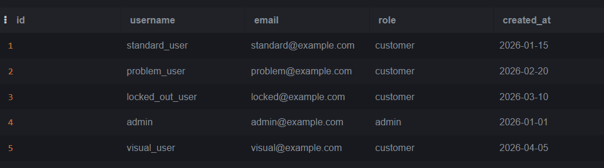

- Таблица products
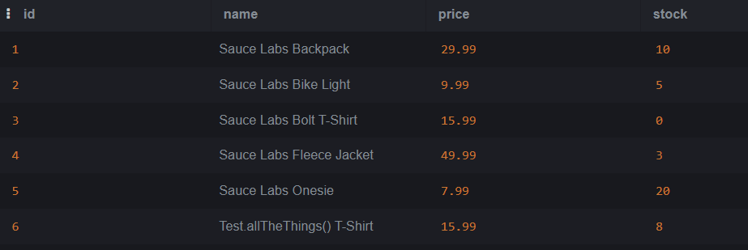

- Таблица orders
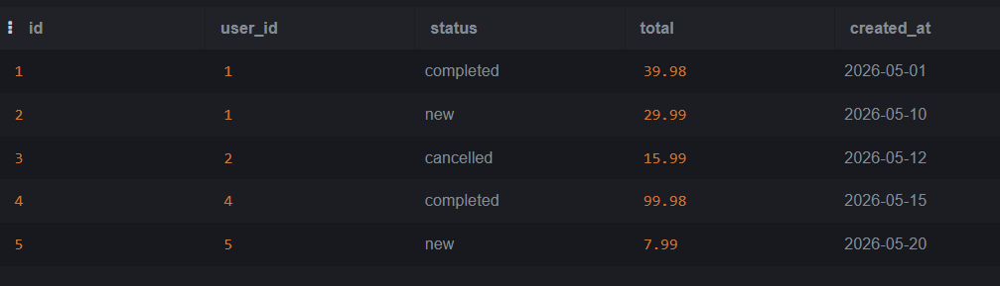

- Таблица order_items
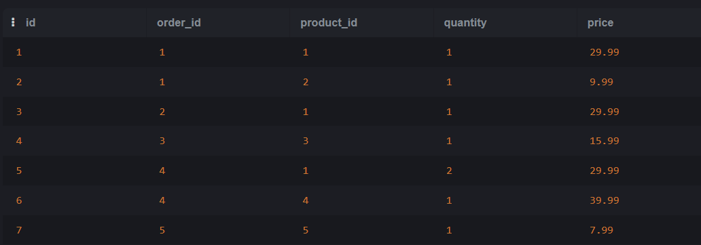

## 1. Простые SELECT
- SELECT * FROM users
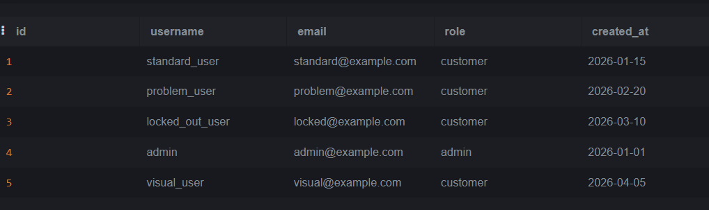

- SELECT username, email FROM users
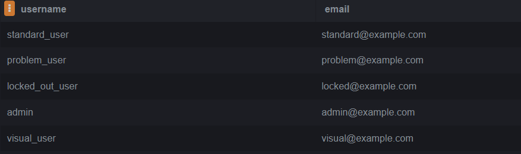

- SELECT * FROM users WHERE role = 'admin'
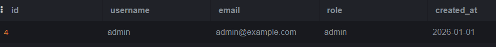

- SELECT * FROM products ORDER BY price ASC
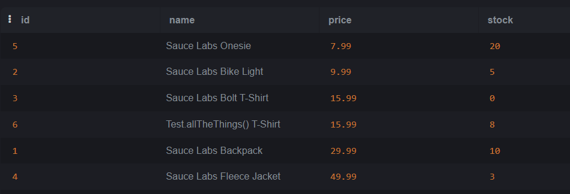

- SELECT * FROM users LIMIT 3;
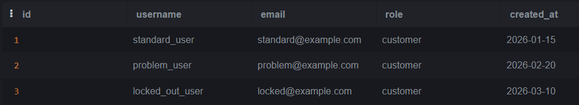

## 2. Фильтрация WHERE
- SELECT * FROM products WHERE price > 15
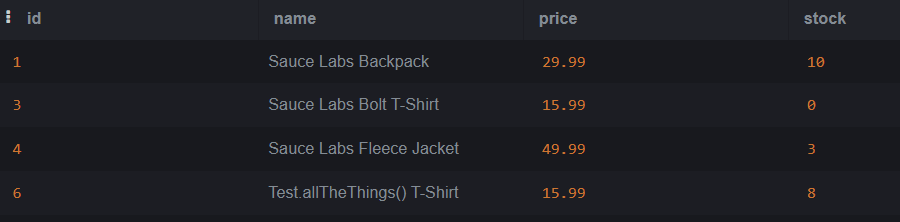

- SELECT * FROM users WHERE created_at > '2026-03-01'
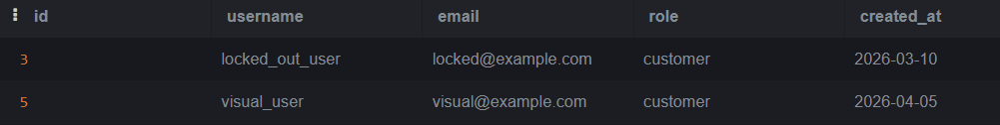

- SELECT * FROM orders WHERE status IN ('new', 'completed')
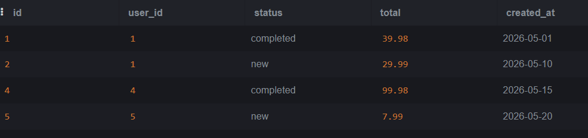

- SELECT * FROM products WHERE price BETWEEN 10 AND 30
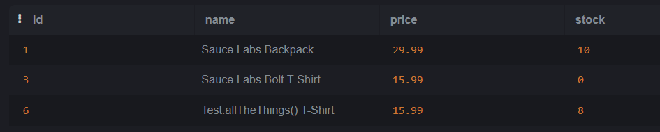

- SELECT * FROM users WHERE username LIKE '%user%'
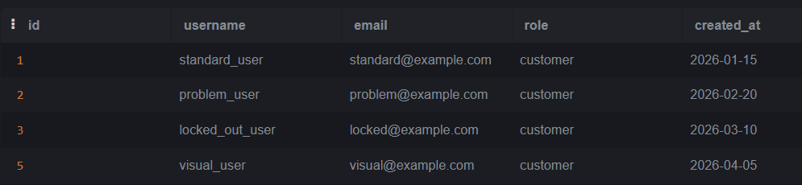

## 3. Агрегатные функции
- SELECT COUNT(*) FROM orders WHERE status = 'completed'
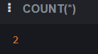

- SELECT AVG(price) FROM products
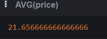

## 4. GROUP BY 
- SELECT status, COUNT(*) AS order_count
  FROM orders
  GROUP BY status
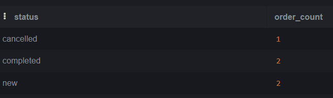

- SELECT user_id, COUNT(*) AS order_count
  FROM orders
  GROUP BY user_id
  HAVING COUNT(*) > 1
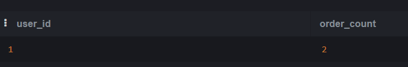

## 6. JOIN

- SELECT u.username, o.id AS order_id, o.status, o.total
  FROM orders o
  INNER JOIN users u ON o.user_id = u.id
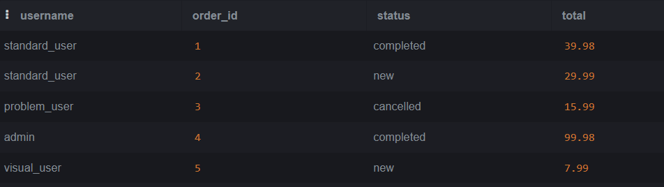

## 7. INSERT, UPDATE, DELETE

- INSERT INTO users (id, username, email, role, created_at)
  VALUES (6, 'new_user', 'new@example.com', 'customer', '2026-09-25')

- UPDATE users SET role = 'admin' WHERE id = 6
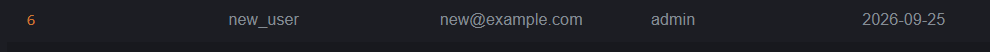

- DELETE FROM users WHERE id = 6
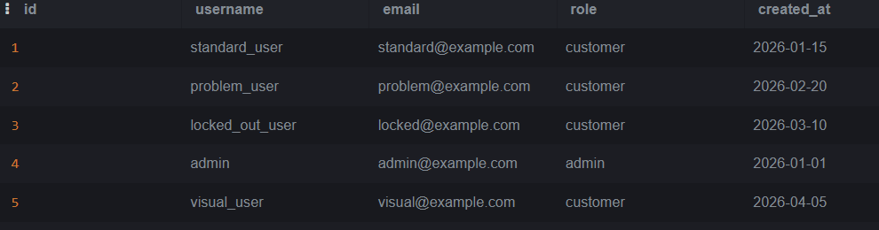

## Практические сценарии 

Сценарий 1. Проверить, что заказ создан

Пользователь оформил заказ в UI. Проверяем в БД

- SELECT * FROM orders
 WHERE user_id = 1
 ORDER BY created_at DESC
 LIMIT 1
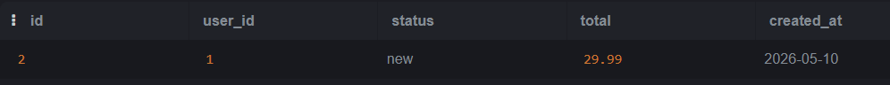

Если запись есть и status = 'new' — заказ создан корректно.

Сценарий 2. Найти заказы без пользователей

- SELECT o.id, o.user_id
  FROM orders o
  LEFT JOIN users u ON o.user_id = u.id
  WHERE u.id IS NULL
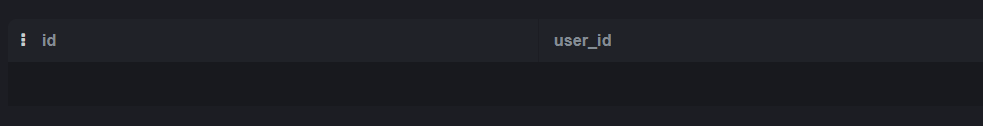

Если результат не пустой — баг целостности данных.

Сценарий 3. Найти дубли email

- SELECT email, COUNT(*) AS cnt
  FROM users
  GROUP BY email
  HAVING COUNT(*) > 1

Если результат есть — баг уникальности.

Сценарий 4. Найти товары с отрицательной ценой

- SELECT * FROM products WHERE price < 0;

Если есть — критический баг.

